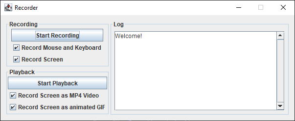

# recorder
[](https://github.com/Tait1337/recorder/actions)
[](https://sonarcloud.io/dashboard?id=Tait1337_recorder)
[](LICENSE)

Java Recorder that combines Macro and Screen Recorder.

Perfect for:
- automate tedious routines.
- screen capture how to perform a task.

Record, save, load and play the recordings of your system mouse and keyboard actions.

Capture the system screen and sound as video or animated gif file.

## Getting Started

These instructions will get you a copy of the project up and running on your local machine for development and testing purposes. See deployment for notes on how to deploy the project on a live system.

### Prerequisites

Install Java JDK 17 or higher.
```
https://openjdk.java.net/install/index.html
```

### Installing

Clone the Repository.
```
git clone https://github.com/tait1337/recorder.git
```

Build the Web Application with Maven.
```
./mvn install
```

Check the chapter Configuration for FFmpeg and sound device configurations.

Run the Application.
```
java -jar ./target/recorder-1.0.0-SNAPSHOT.jar -Dffmpeg.home="/path/to/ffmpeg/bin" -Dffmpeg.audio.input.device="Stereomix (Realtek High Definition Audio)"
```



### Configuration

You can do configurations with [application.properties](src/main/resources/application.properties) or via java command line parameter -D

[Download](https://ffmpeg.org/download.html) and extract the latest FFmpeg release. Please use the GPL licensed version which comes with libx264 encoder.
```
/path/to/ffmpeg/bin/ffmpeg -version
```

Get the name of your system sound device. On Windows, you need to activate [Stereo Mix](https://www.howtogeek.com/howto/39532/how-to-enable-stereo-mix-in-windows-7-to-record-audio/) first.
```
ffmpeg -list_devices true -f dshow -i dummy
```

## Running the tests

Tests can be executed via Maven.

```
./mvn test
```

## Deployment

The most basic option to run the Application is by copying the `./target/recorder-1.0.0-SNAPSHOT.jar` file to the target system with pre-installed FFmpeg and Java Runtime Environment and execute it there.

```
cp ./target/recorder-1.0.0-SNAPSHOT.jar /target/system/path/
java -Dffmpeg.home="/path/to/ffmpeg/bin" -Dffmpeg.audio.input.device="Stereomix (Realtek High Definition Audio)" -jar /target/system/path/recorder-1.0.0-SNAPSHOT.jar
```

## Contributing

I encourage all the developers out there to contribute to the repository and help me to update or expand it.

To contribute just create an issue together with the pull request that contains your features or fixes.

## Versioning

We use [GitHub](https://github.com/) for versioning. For the versions available, see the [tags on this repository](https://github.com/tait1337/recorder/tags). 

## Authors

* **Oliver Tribess** - *Initial work* - [tait1337](https://github.com/tait1337)

## License

This project is licensed under the GNU General Public License v3.0 - see the [LICENSE](LICENSE) file for details

## Acknowledgments

* [AdoptOpenJDK](https://adoptopenjdk.net/) Team for providing a free JDK 
* [FFmpeg](https://ffmpeg.org/) - the cross-platform solution to record, convert and stream audio and video
* [JNativeHook](https://github.com/kwhat/jnativehook) - the global keyboard and mouse listener library